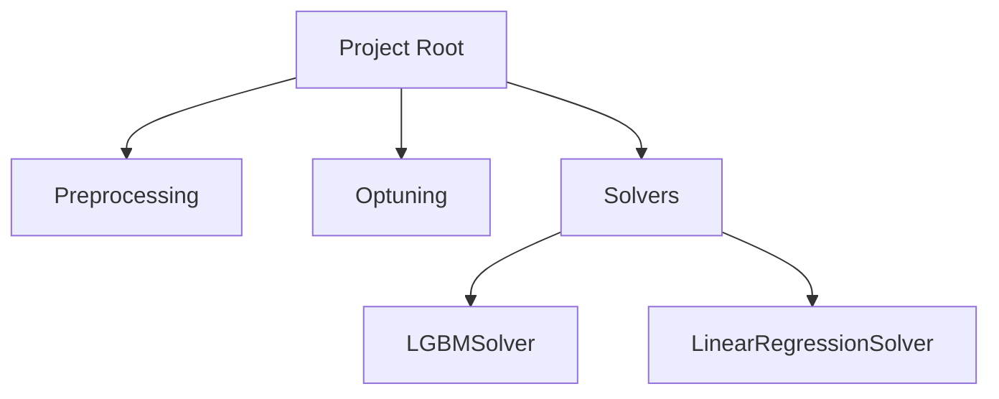
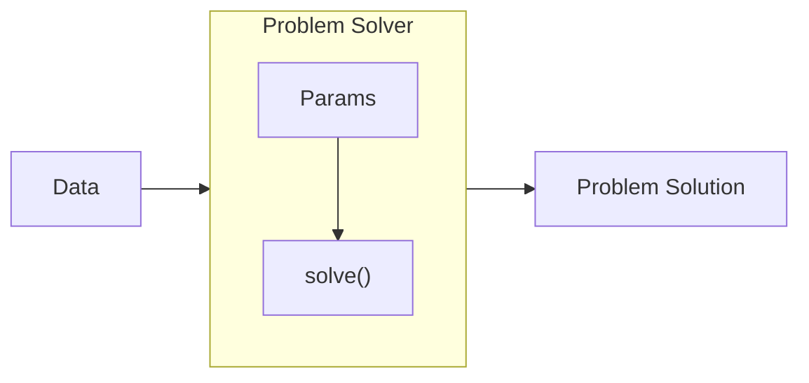
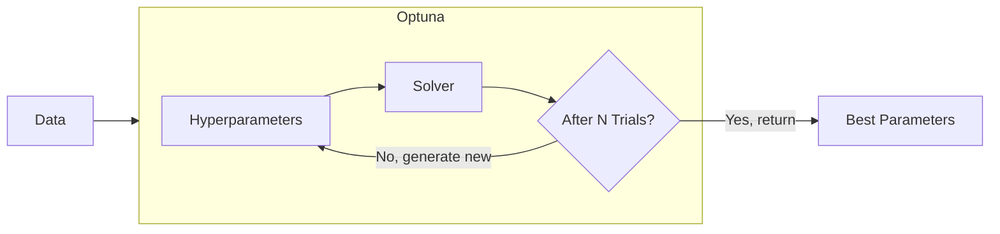

# chatbot-arena

Coursework of *Advanced Machine Learning* of NJUST.


This project aims at the competition [WSDM Cup - Multilingual Chatbot Arena](https://www.kaggle.com/competitions/wsdm-cup-multilingual-chatbot-arena) on Kaggle. In short, conversations between a user and two LLMs are given, and this competition challenges us to predict which responses users will prefer.

> **Data files**
> 
> Related data files are placed under the `data/` folder. However, they are not uploaded here due to GitHub's file 
> size limit. Refer to the competition page to download them.

- [chatbot-arena](#chatbot-arena)
  - [Reference](#reference)
  - [Project Structure](#project-structure)
    - [Preprocessing Module](#preprocessing-module)
    - [Solvers Module](#solvers-module)
    - [Optuning Module](#optuning-module)
  - [Build system](#build-system)
  - [Build with pip](#build-with-pip)

## Reference
We referenced an existing Competition Notebook [WSDM || AbdBase || V2](https://www.kaggle.com/code/abdmental01/wsdm-abdbase-v2). Thank you [Sheikh Muhammad Abdullah](https://www.kaggle.com/abdmental01) for your dedication!

## Project Structure
Here's the visualization of source code, in Python modules:


### Preprocessing Module
Preprocessing is the first operation we should perform on the data once they're loaded. The original data is provided in the form of [`pandas.DataFrame`](https://pandas.pydata.org/pandas-docs/stable/reference/api/pandas.DataFrame.html), which contains the raw text of the conversation between the user and two LLMs, the conversation ID, which answer the user prefers and so on.

To convert the original data into a vectored representation that most Maching Learning models are more easily to be trained some on, preprocessing *pipelines* are applied, including but not limited to:

- `MapColumnValues`: maps the user's choice (`"model_a"` or `"model_b"`) into numbers (`0` or `1`).
- `DropColumns`: drop some columns that are considered irrelevant to be passes as input features.
- `Compute`-series pipeline: computes some manually picked features (length, word count, lexical diversity, etc.) of a column.
- `VectorizationByTfidf`: turning a text paragraph into a vector of numbers (i.e. vectorization). In this project, TF-IDF vectorization is adopted.

After those preprocessing steps, the original data is transformed into a `DataFrame` containing only numbers in each column.

> **Pipelines**
>
> Instead of writing redundant column assignment code everywhere, the pipeline design pattern (i.e. the [Chain of Responsibility pattern](https://en.wikipedia.org/wiki/Chain-of-responsibility_pattern)) is adopted to make preprocessing code more tidy, extensible and maintainable.
>
> The pattern can be described using the graph below:
>
> ```mermaid
> 
> graph LR
>
> I[Input Data]
> O[Output Data]
>
> subgraph Pipelines
>   direction LR
>
>   D[Drop Column]
>   C[Compute]
>   E[...]
>
>   D --> C
>   C --> E
> end
>
> I --> D
> E --> O
> 
> ```
>
> In addition to processing the data, pipelines pass the processed data further along the chain. The data travels along the chain until all pipeline have had a chance to process it. The pipelines can be added, removed, reordered and reused in other processing steps (e.g. the processing pipeline in `LGBMSolver` can be easily reused in `LinearRegressionSolver`), without writing some column-assignment boilerplate.

### Solvers Module
The solvers module is the core abstraction of this project.

A `ProblemSolver` is an object that stores data at creation, takes a corresponding `Params` object when `solve()` is called and returns a `ProblemSolution` object when done solving the problem.



Different solver implements the `solve` method differently. For example, `LGBMSolver` trains multiple models using Stratified K-Fold strategy, and using those models to make predictions together. 

### Optuning Module
This module is aimed at utilizing the [`optuna`](https://optuna.org/) package to choose the best hyperparameters automatically.

Solvers are designed to be called multiple times, and hyperparameters are passed in the `Params` object. This means we can easily **generate** hyperparameters and test how they perform on a specific problem solver using `optuna`.




## Build system
This project adopts [PDM](https://pdm-project.org/) as build system. Modern build systems (like PDM) are preferred over vanilla `pip` tool, because PDM handles virtual environment & package management automatically and correctly.

> For example, the vanilla `pip` tool **won't remove indirectly referenced dependencies** when removing the direct ones. When installing `torchvision`, pip will install `pillow` and other packages required by `torchvision`, but will leave them unchanged when `torchvision` is removed.

To install & use PDM, see [the official installation guide](https://pdm-project.org/en/latest/#installation).

## Build with pip
For compatibility, a `requirements.txt` file is provided along with the modern python package config file (`pyproject.toml`). To perform vanilla installation of dependencies, run:

```shell
pip install -r requirements.txt
```

> **NOTE**: This `requirements.txt` is automatically generated by PDM using `pdm export` command. No guarantee is made when it comes to full `pip` compatibility.

Virtual environments are recommended in case to keep the global Python environment clean.